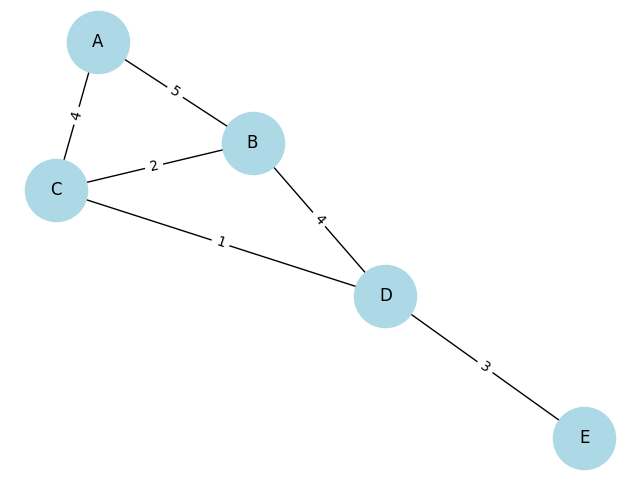

# goit-algo-hw-06

## task01

### Граф транспортної мережі



## task02

```
список суміжності
{'A': ['B', 'C'], 'B': ['A', 'C', 'D'], 'C': ['A', 'B', 'D'], 'D': ['B', 'C', 'E'], 'E': ['D']}

DFS: A B C D E
BFS: A C B D E

```

Різні порядки обходу пов'язані з тим, як алгоритми обирають сусідів для відвідування. DFS заглиблюється в граф, тоді як BFS досліджує сусідів на поточному рівні перед переходом до наступного. Порядок відвідування може змінюватися в залежності від структури графа та порядку сусідів.
