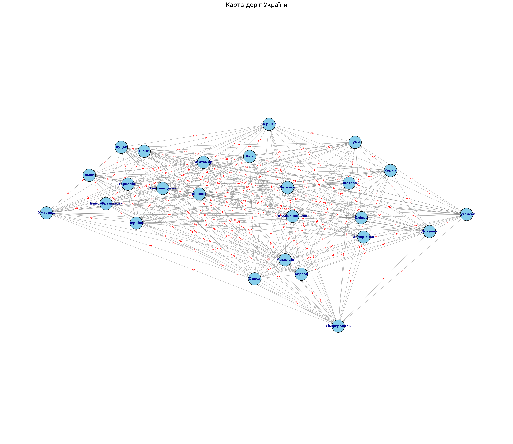

# Vibe Coding with Gemini

За основу взяв
[Таблиця відстаней між головними містами України](https://yourdriver.com.ua/uk/about-us/blog/korisna-informaciya)

Побудував граф транспортної мережі. Так як вхідні дані не відображають маршрутів, то вийшов повний граф.

Для корректної побудови графа потрібно використати, наприклад, [OpenStreetMap with OSMnx](https://networkx.org/documentation/stable/auto_examples/geospatial/plot_osmnx.html)

## RTFM

-   [Analyzing OpenStreetMap Road Network Attributes with NetworkX, PyG and Graph Neural Networks](https://medium.com/@aditiajain/analyzing-openstreetmap-road-network-attributes-with-networkx-pyg-and-graph-neural-networks-2f3d7b0f832)
-   [Planning the Perfect Hike with NetworkX and OpenStreetMap](https://towardsdatascience.com/planning-the-perfect-hike-with-networkx-and-openstreetmap-2fbeaded3cc6/)
-   https://wiki.openstreetmap.org/wiki/OSMnx
